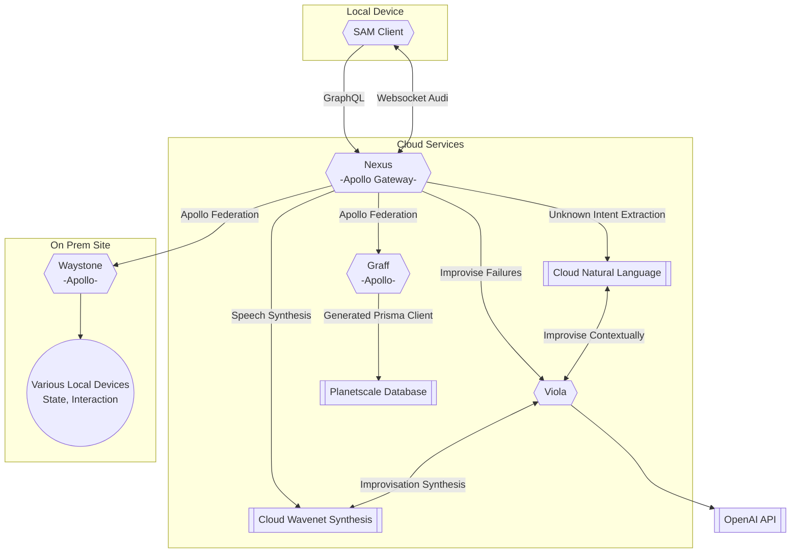

# Aubron's Personal Infrastructure Monorepo

This repository contains a monorepo of the critical infrastructure powering SAM, a natural language life management engine designed to operate as a security system, task and queue management tool, and smarthome platform.

## The path diverges ahead:

The infrastructure is broken into microservices, which roughly map to directories in this folder:

### Implemented

#### [/graff/](/graff/) - **Graff**
The knowledge graph. This is a graphql server meant to provide internal read/writable access to known truth for safe network clients. Prisma managed PlanetScale database.

#### [/nexus/](/nexus/) - **Nexus**
The hub of all networks. Guarddog and pathfinder, a graphql federation server that assembles and protects a singular exposed supergraph. Apollo Gateway running on Elastic Beanstalk

### Unimplemented (Planned)

#### [/sam/](/sam/) - **SAM**
Secure, Assure, Mitigate. Natural language interface for the network, providing wake word functionality, authentication, and managed access to the network.

#### [/viola/](/viola/) - **Viola**
The improvisation engine. While SAM is capable of responding to user-triggered requests, Viola is a neural-network-driven daemon, actively seeking possible actions. Pulls double duty by generating unknown intent responses, where improvisation is needed.

#### [/waystone/](/waystone/) - **Waystones**
The bridge to reality. A microservice run at all local sites, meant to bridge local network access and expose the real world to the network. Apollo GraphQL server.

## You find a Map:

